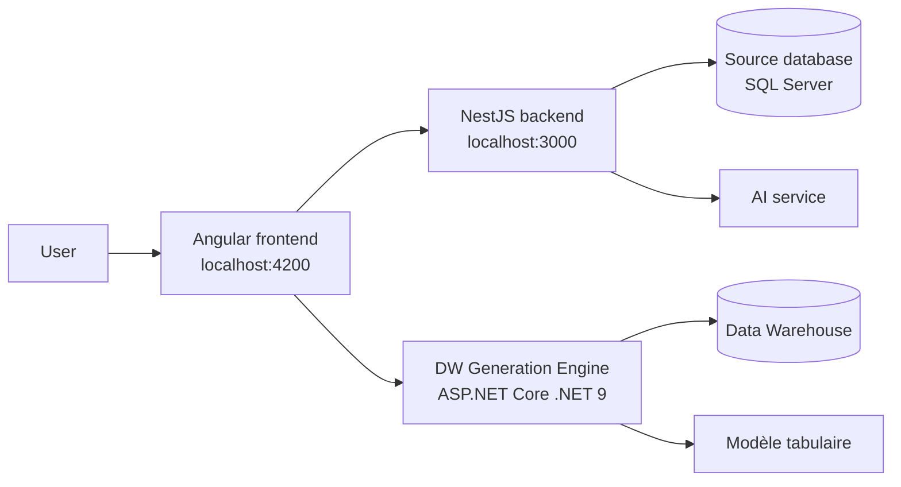

# DW AI Code

<p align="center">
  <strong>Intelligent Data Warehouse design and deployment platform</strong>
</p>

<p align="center">
  <a href="#features">Features</a> ·
  <a href="#architecture">Architecture</a> ·
  <a href="#demo">Demo</a> ·
  <a href="#quick-start">Quick start</a>
</p>

<p align="center">
  
  
  
  
</p>

> An end-to-end solution that turns files and metadata into an AI-assisted dimensional schema, then generates and deploys a Data Warehouse and tabular model.

## Table of contents

- [Features](#features)
- [Demo](#demo)
- [Architecture](#architecture)
- [Prerequisites](#prerequisites)
- [Quick start](#quick-start)
- [Functional workflow](#functional-workflow)
- [Main APIs](#main-apis)
- [Configuration](#configuration)
- [Repository structure](#repository-structure)
- [Testing and quality](#testing-and-quality)
- [Troubleshooting](#troubleshooting)

## Features

- Import `CSV`, `XLSX`, `XLS`, and `TXT` files.
- Source database creation and selection.
- Metadata analysis and cross-table relationship detection.
- AI-assisted dimensional schema proposal generation.
- Conversational schema editing with step history and rollback support.
- Schema validation and persistence.
- SQL DDL generation, ETL execution, and tabular model deployment.
- Full pipeline execution in a single operation.

## Demo

Place the demo video exactly here:

```text
docs/demo/demo.mp4
```

Once the file is added, it will be available here: [Watch the demo video](docs/demo/demo.mp4).

For a large video, hosting it on YouTube, Vimeo, or Loom is recommended. Replace the link above with the public URL. GitHub does not always render video tags directly in a README, so a file link or hosted-video link is the most reliable option.

## Architecture



### Components

| Component | Folder | Responsibility | Default port |
|---|---|---|---:|
| Frontend | `frontend/` | Angular user interface | `4200` |
| Backend | `backend/` | Upload, metadata, schemas, and AI sessions | `3000` |
| DW Generation Engine | `DwGenerationEngine/` | DDL, ETL, orchestration, and tabular deployment | `HTTPS`, according to the .NET profile |

## Prerequisites

- Node.js compatible with Angular 21 and npm 11.
- .NET SDK 9.
- SQL Server accessible from the required services.
- An AI instance or service configured for the backend.
- PowerShell, VS Code terminal, or an equivalent terminal.

## Quick start

### 1. Backend NestJS

```powershell
cd backend
npm install
npm run start:dev
```

The backend starts by default at `http://localhost:3000`.

### 2. Frontend Angular

In another terminal:

```powershell
cd frontend
npm install
npm start
```

The frontend is available at `http://localhost:4200`.

### 3. DW Generation Engine

In a third terminal:

```powershell
cd DwGenerationEngine
dotnet restore
dotnet run --project DwGenerationEngine.Api
```

The exact URL is displayed in the terminal. In development, Swagger is available at `/swagger`.

## Functional workflow

1. The user creates or selects a source database.
2. The user imports one or more data files.
3. The backend builds metadata and detects possible relationships.
4. A schema proposal is generated and edited with the conversational assistant.
5. The user validates the schema.
6. The .NET engine generates DDL, runs ETL, and deploys the tabular model.
7. The full pipeline returns the status and errors for each step.

## Main APIs

### NestJS backend

| Method | Route | Usage |
|---|---|---|
| `POST` | `/upload` | Upload up to 10 files |
| `GET` | `/upload/databases` | List available databases |
| `POST` | `/upload/databases` | Create a database |
| `GET` | `/upload/metadata/:database` | Read metadata and relationships |
| `POST` | `/upload/:database/deploy` | Trigger Data Warehouse deployment |
| `GET` | `/ai/schema/:database` | Generate a schema |
| `POST` | `/ai/schema/:database/session` | Start an editing session |
| `POST` | `/ai/schema/:database/session/:sessionId/chat` | Modify a schema with a message |
| `GET` | `/ai/schema/:database/session/:sessionId/history` | Read session history |

For uploads, the multipart file field is `files` and the target database field is `database`.

### DW Generation Engine

| Method | Route | Usage |
|---|---|---|
| `GET` | `/api/dw/health` | Check engine availability |
| `POST` | `/api/dw/generate-ddl` | Generate Data Warehouse tables |
| `POST` | `/api/dw/run-etl` | Run ETL |
| `POST` | `/api/dw/deploy-tabular` | Deploy the tabular model |
| `POST` | `/api/dw/build-full-pipeline` | Run the full pipeline |

## Configuration

### Backend

Keep local secrets and settings in `backend/.env`, which is ignored by Git. Check the SQL connection, AI service, and listening port before starting the application.

### DW Generation Engine

Development settings are stored in `DwGenerationEngine/DwGenerationEngine.Api/appsettings.Development.json`. Do not commit real secrets. The API also uses an API-key middleware; configure the expected key before calling protected routes.

### Frontend

Service URLs used by the frontend are defined in the Angular configuration under `frontend/src/`. Update them if the backend or .NET engine does not use the default local ports.

## Repository structure

```text
.
├── README.md
├── docs/
│   └── demo/
│       ├── README.md
│       └── demo.mp4              # add the demo video here
├── frontend/                     # Angular application
├── backend/                      # NestJS API
└── DwGenerationEngine/           # .NET 9 solution
    ├── DwGenerationEngine.Api/
    ├── DwGenerationEngine.Core/
    ├── DwGenerationEngine.Infrastructure/
    └── DwGenerationEngine.Tests/
```

## Testing and quality

### Backend

```powershell
cd backend
npm run lint
npm test
npm run test:e2e
npm run test:cov
```

### Frontend

```powershell
cd frontend
npm run build
npm test
```

### .NET

```powershell
cd DwGenerationEngine
dotnet build
dotnet test
```

## Troubleshooting

- **The frontend cannot reach the backend**: check that NestJS listens on `3000` and that CORS allows `http://localhost:4200`.
- **Upload fails**: check the `files` field, the `database` field, and the file extension.
- **The .NET engine rejects a request**: check the submitted schema, API key, and SQL/Tabular connections.
- **Swagger is unavailable**: run the .NET API with the `Development` environment.

## Licence

Private project. Distribution and usage rules must be defined by the project owners.
